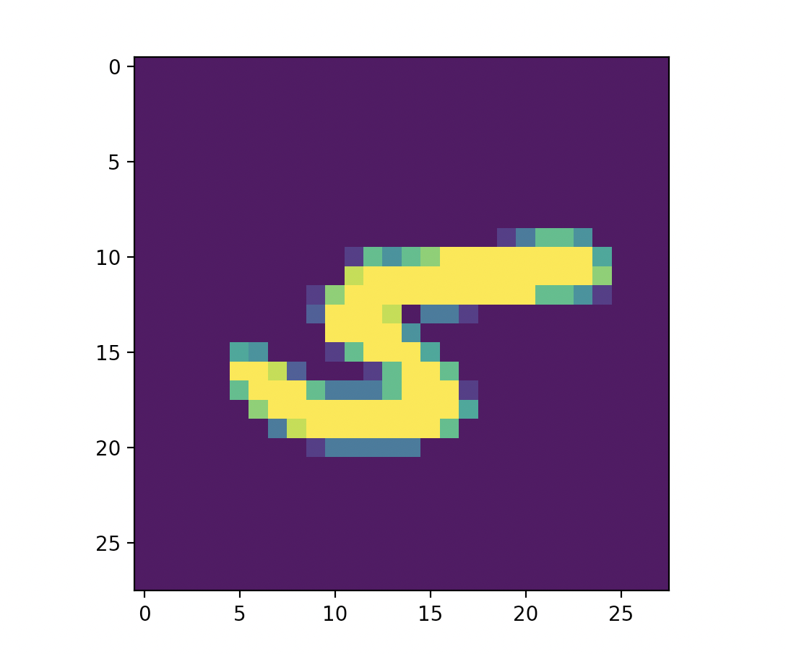

# DL-zoo
Personal implementations of notable deep learning papers. 

Papers currently implemented: 
- **Convolutional Neural Network (CNN)**: *[Backpropagation Applied to Handwritten Zip Code Recognition](http://yann.lecun.com/exdb/publis/pdf/lecun-89e.pdf)* by LeCun *et al.* (1989)

## Convolutional Neural Network
Original paper: *[Backpropagation Applied to Handwritten Zip Code Recognition](http://yann.lecun.com/exdb/publis/pdf/lecun-89e.pdf)* by LeCun *et al.* (1989)  
File: `CNN.py` (code), `CNN.pth` (trained model)

